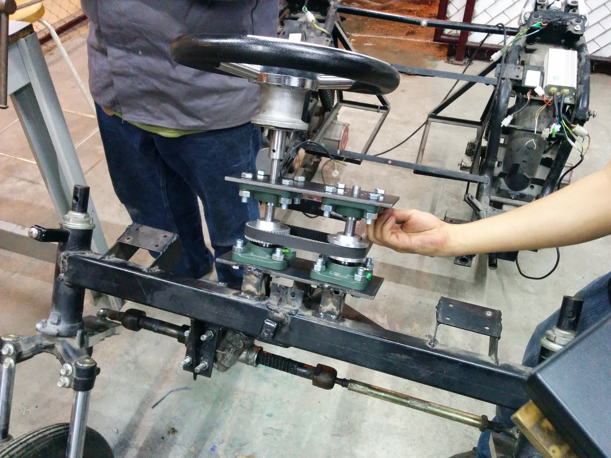

# Design and construction of a control system for the autonomous driving of the electric car: *El Azteca Marron*

This repo contains the codes and some documentation related to the project **Design and construction of a control system to
achieve the autonomous driving of the electric car *El Azteca Marron* under controlled environments.** 

The development of this project different methods and techniques were used, including: the implementation of a fuzzy-logic-based system was implemented in the control of the steering wheel. The detection of the surroundings was achieved by making use a set of different kind of sensing systems, these were LIDAR and ultrasonic sensors along with cameras and computer vision algorithms. In the case of the computer vision system different edge detection techniques, including the use of the Hough transform, were implemented in order to detect the borders of the road.

The master control unit was implemented using the embedded board PcDuino and the programing languages Python and C++. Several tests were carried out by separate for each of the systems, this were: the braking system, the surroundings and obstacle detection system and the steering wheel system. In the final stage, all the systems were tested altogether. The tests carried out to evaluate the
motion of the vehicle were performed in two different steps; first, the car was set still by placing it over a base from which the response of the actuators, afterward, the test were carried out taking off the restraints, allowing the movement of the car. A graphic interface was added and connected to the embedded board which was tried within the other systems. The vehicle was able to avoid obstacles still and in movement, detected between a range of 10 to 25 meters at a speed of 7km/h.

The complete report can be found here:

[PDF](https://drive.google.com/open?id=1AQz76EegUP3XW2wpDUsQXpY6KcQkYidY) (Only in Spanish)

Some videos documenting the tests carried out can be seen here:

[Videos](https://www.youtube.com/channel/UCT0Ob93REGyEb-Z6Aw5lSOA)

## Resume about the Desing and Implementation

The key elements to consider during the design were: the detection ranges of the sensors, the price of the sensors, the processing speed of the board, the number of communication ports of the board and documentation existing on the web about it and the sensors, and the OS which the board was able to work with. In the case of the main control board, the steering wheel system and the braking system the characteristics taken into account were, the safety mechanism and the emergency brake system among others. 

The diagram shows the general concept of the structure of the vehicle. The vehicle counts with 4 batteries of 12v which power 2 brushless motors in the back wheels. The speed control is carried out by a specialized driver. In the case of the steering wheel system, the vehicle already counted with a transmission system which translates the movement of the steering wheel to the front wheels. Thus, the already existing structural elements were used in the design of the autonomous steering wheel system. 

In the design of the detection system the structure of the car was taken into account, the sensors were placed only on the sides and on the fron due the fact that this vehicle wasn't able to go in reverse. 

The final diagram of the steering wheel system is showed bellow:

And its implementation in the vehicle:

The control of the the break was done using the Motor EMG49 within its respective controller MD49. A diagram of the control system is shown bellow

The break used consisted of a handle which could be activated both, manually and automatically, the last one was done by using a  servomotor GS-4060BB. A diagram of the breaking system is shown bellow

And the electric diagram for the control of the breaking system

